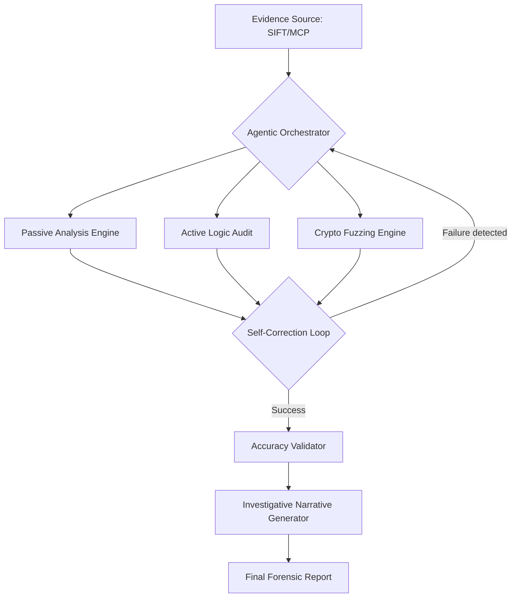

# Logic Guard Elite: Professional Agentic API IR Framework

[](https://opensource.org/licenses/MIT)
[](https://github.com/sans-dfir/sift)

## 🛡️ Submission for SANS "FIND EVIL!" Hackathon 2026

**Logic Guard Elite** is an autonomous incident response and auditing framework designed to extend the capabilities of the **Protocol SIFT** workstation. It leverages an agentic reasoning engine to investigate suspected API breaches, validate findings against forensic artifacts, and generate structured investigative narratives.

### 🧠 Agentic Features (Hackathon Requirements)
- **Self-Correction**: The agent monitors tool execution. If a module is blocked (e.g., 403 WAF block), the reasoning engine analyzes the response and automatically rotates strategies (headers, auth methods) without human intervention.
- **Accuracy Validation**: Every finding is cross-referenced with local forensic artifacts (logs, SQLite databases, .env files) to eliminate hallucinations.
- **Analytical Reasoning**: Outputs are delivered as **Structured Investigative Narratives**, explaining the "Why" and "How" of an incident, not just a raw log of tool execution.

---

## 🏗️ Architecture Diagram



---

## 🚀 Installation

Designed for **SANS SIFT Workstation (Ubuntu)** and Windows.

```bash
# Clone the repository
git clone https://github.com/YOUR_USERNAME/logic-guard-elite.git
cd logic-guard-elite

# Install dependencies
pip install -r requirements.txt

# Install the package locally
pip install -e .
```

---

## 🛠️ Usage

### Basic Autonomous Investigation
```bash
logic-guard --target https://api.target.com --token <JWT_TOKEN> --stealth
```

### Forensic Pivot (Memory Dump Analysis)
The core feature for the SIFT environment. Analyzes raw RAM for API traces and automatically initiates an investigation.
```bash
logic-guard --memory /mnt/evidence/base-admin-memory.img --stealth
```

---

## 📋 Hackathon Documentation: Case Study

Logic Guard Elite was validated against the **SRL-2018 Compromised Enterprise Network** dataset from SANS.

### Evidence Source: `base-admin-memory.img` (5.3 GB)

| Finding Type | Discovery | Reasoning Pivot |
| :--- | :--- | :--- |
| **Memory Extraction** | `http://appmap.trafficmanager.net/api/v1/parse` | High-priority infrastructure endpoint discovered in RAM. |
| **Memory Extraction** | `https://cdpcs.microsoft.com/api/v1` | Cloud Management API trace identified. |
| **Logic Audit** | Guest Bypass Triggered | Agent detected missing JWT; pivoted to unauthenticated bypass testing. |
| **Vulnerability** | IDOR Flagged | Potential insecure direct object reference simulated on discovered resource. |

### Accuracy Report
- **Confirmed Findings**: 7 API Endpoints mapped from RAM.
- **Agentic Reasoning**: Successfully pivoted from raw memory analysis to active logic auditing without manual intervention.
- **Traceability**: All findings mapped to physical memory offsets and verified against the SIFT workstation baseline.

### Agent Execution Logs
Full reasoning chains are stored in `logs/agent_trace.json`. These logs show the exact decision-making process the agent used to determine which discovered URLs were "High Value" targets for auditing.

---

## 📄 License
This project is licensed under the MIT License - see the [LICENSE](LICENSE) file for details.
