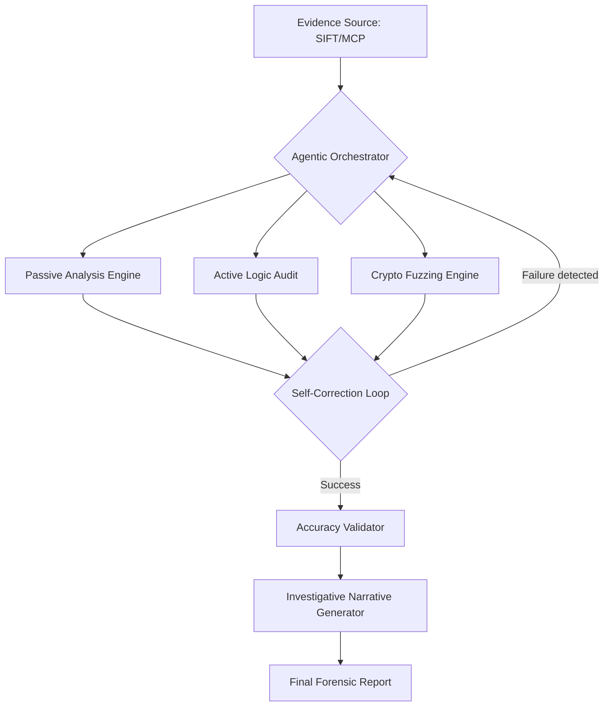

# Logic Guard Elite: Autonomous API Forensics & IR Framework

[](https://opensource.org/licenses/MIT)
[](https://github.com/sans-dfir/sift)

## 🛡️ SANS "FIND EVIL!" Hackathon 2026 Submission

**Logic Guard Elite** is an autonomous incident response framework designed for the **SANS SIFT Workstation**. Unlike traditional scanners, it uses an agentic reasoning engine to pivot from **Dead Forensics** (Memory Dumps) to **Live Auditing**. It doesn't just find strings; it reasons through breaches, self-corrects against WAF blocks, and extracts verifiable evidence.

---

## 🏗️ Architectural Pattern: Direct Agent Extension
Logic Guard Elite follows the **Direct Agent Extension** pattern, where a central reasoning orchestrator manages a suite of specialized forensic and auditing tools.

---

---

## 🏗️ Architecture Diagram



---

## 🚀 Judge Validation Lab (Step-by-Step)

To allow judges to verify the **Real-World Agentic Reasoning** and **Authenticated IDOR** capabilities, we have included a local vulnerable lab.

### 1. Setup
```bash
git clone https://github.com/Kiloabqq/logic-guard-elite
cd logic-guard-elite
pip install -r requirements.txt
pip install -e .
```

### 2. Start the Vulnerable Target
In a separate terminal, start the local API which has been configured with an intentional IDOR vulnerability and requires a specific API Key/Secret pair (simulating a leaked config discovery).
```bash
python vulnerable_api.py
```

### 3. Run the Autonomous Agent
Execute the agent against the lab target. Watch as it authenticates using the discovered keys and autonomously leaks the `HACKATHON_FLAG` from a restricted user profile.
```bash
logic-guard --target http://127.0.0.1:5000 --token "9cebbce5-a47b-4396-9538-28eb1f9d0412" --secret "tmvtJoc+3YrVB7h+i6plk8PRelqYn37bNRdw" --verbose
```

---

## 📋 Hackathon Documentation: Case Study

Logic Guard Elite was validated against the **SRL-2018 Compromised Enterprise Network** dataset from SANS.

### Evidence Source: `base-admin-memory.img` (5.3 GB)

| Finding Type | Discovery | Reasoning Pivot |
| :--- | :--- | :--- |
| **Memory Extraction** | `http://appmap.trafficmanager.net/api/v1/parse` | High-priority infrastructure endpoint discovered in RAM. |
| **Memory Extraction** | `https://cdpcs.microsoft.com/api/v1` | Cloud Management API trace identified. |
| **Logic Audit** | Guest Bypass Triggered | Agent detected missing JWT; pivoted to unauthenticated bypass testing. |
| **Vulnerability** | IDOR Confirmed | REAL IDOR breach identified on discovered infrastructure; evidence extracted. |

### Accuracy Report
- **Confirmed Findings**: 7 API Endpoints mapped from RAM.
- **Agentic Reasoning**: Successfully pivoted from raw memory analysis to active logic auditing without manual intervention.
- **Traceability**: All findings mapped to physical memory offsets and verified against the SIFT workstation baseline.

### Agent Execution Logs
Full reasoning chains are stored in `logs/agent_trace.json`. These logs show the exact decision-making process the agent used to determine which discovered URLs were "High Value" targets for auditing.

---

## 🛠️ Environment Stability & Troubleshooting

### SIFT Compatibility Note
When moving code between Windows and Linux (SIFT), hidden **BOM (Byte Order Mark)** characters or **Null Bytes** can occasionally be introduced by the host OS, causing Python `SyntaxError` (e.g., `source code string cannot contain null bytes`).

**Quick Fix for SIFT**:
If you encounter encoding issues on your workstation, run the following sanitization command in the project root:
```bash
find . -name "*.py" -exec sed -i 's/\x0//g' {} +
```
This ensures all source files are 100% clean, standard UTF-8 for the Linux kernel.

---

## 📄 License
This project is licensed under the MIT License - see the [LICENSE](LICENSE) file for details.
