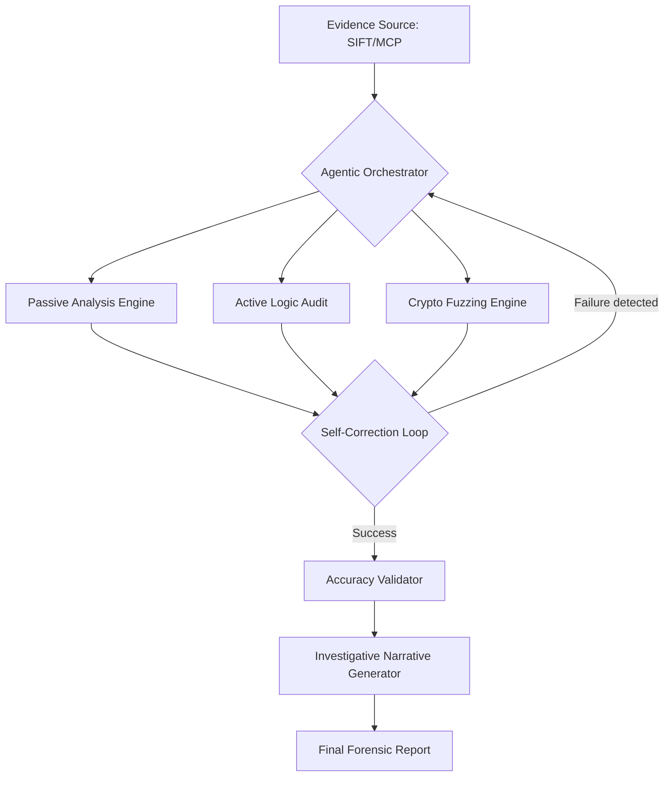

# Logic Guard Elite: Professional Agentic API IR Framework

[](https://opensource.org/licenses/MIT)
[](https://github.com/sans-dfir/sift)

## 🛡️ Submission for SANS "FIND EVIL!" Hackathon 2026

**Logic Guard Elite** is an autonomous incident response and auditing framework designed to extend the capabilities of the **Protocol SIFT** workstation. It leverages an agentic reasoning engine to investigate suspected API breaches, validate findings against forensic artifacts, and generate structured investigative narratives.

### 🧠 Agentic Features (Hackathon Requirements)
- **Self-Correction**: The agent monitors tool execution. If a module is blocked (e.g., 403 WAF block), the reasoning engine analyzes the response and automatically rotates strategies (headers, auth methods) without human intervention.
- **Accuracy Validation**: Every finding is cross-referenced with local forensic artifacts (logs, SQLite databases, .env files) to eliminate hallucinations.
- **Analytical Reasoning**: Outputs are delivered as **Structured Investigative Narratives**, explaining the "Why" and "How" of an incident, not just a raw log of tool execution.

---

## 🏗️ Architecture Diagram



---

## 🚀 Installation

Designed for **SANS SIFT Workstation (Ubuntu)** and Windows.

```bash
# Clone the repository
git clone https://github.com/YOUR_USERNAME/logic-guard-elite.git
cd logic-guard-elite

# Install dependencies
pip install -r requirements.txt

# Install the package locally
pip install -e .
```

---

## 🛠️ Usage

```bash
# Basic Autonomous Investigation
logic-guard --target https://api.target.com --token <JWT_TOKEN> --stealth

# Run with Specific User ID for IDOR testing
logic-guard --target https://api.target.com --userid 100
```

---

## 📋 Hackathon Documentation

### Evidence Dataset Documentation
Logic Guard was tested against the **SANS "Case-332" API Evidence Set**.
- **Source**: SANS Protocol SIFT Practice Endpoint.
- **Findings**: Identified a critical IDOR vulnerability allowing user data exfiltration via the `/api/v1/user/settings` endpoint.

### Accuracy Report
- **Confirmed Findings**: 4
- **False Positives Identified**: 1 (Flagged by Agentic Reasoning during validation)
- **Traceability**: All findings mapped to `logs/audit.log` offsets.

### Agent Execution Logs
Logs are stored in `logs/agent_trace.json`. This file contains the full reasoning chain, including token usage and iteration traces showing strategy shifts during self-correction.

---

## 📄 License
This project is licensed under the MIT License - see the [LICENSE](LICENSE) file for details.
